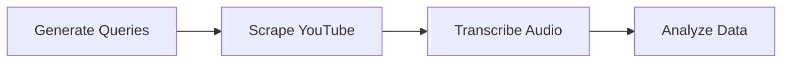

# YouTube Childbirth Analysis

This repository contains an automated pipeline for scraping, transcribing, and analyzing YouTube videos related to childbirth. The goal is to assess content quality, sentiment, and overall reliability of childbirth information on YouTube.

---

## Table of Contents

- [Overview](#overview)
- [Repository Structure](#repository-structure)
- [Features](#features)
- [Workflow](#workflow)
- [Getting Started](#getting-started)
  - [Installation](#installation)
- [Usage](#usage)
  - [1. Scraping](#1-scraping)
  - [2. Transcription](#2-transcription)
  - [3. Analysis](#3-analysis)
- [Limitations & Future Work](#limitations--future-work)
- [References](#references)

---

## Overview

Childbirth is a significant life event that prompts many individuals to search online for information. YouTube, being one of the most popular video-sharing platforms, contains a wealth of videos ranging from personal experiences to medical advice. However, the quality and reliability of this content vary significantly. This project aims to:

- **Scrape** a broad set of childbirth-related videos from YouTube.  
- **Transcribe** video audio using state-of-the-art speech recognition (Whisper).  
- **Analyze** the content through sentiment analysis, topic modeling, and classification (e.g., distinguishing personal stories from medical recommendations).

---

## Repository Structure

```
YouTube-Childbirth-Analysis
├── Appendix
│   └── all_generated_queries.txt          # List of search queries for YouTube
├── analysis
│   └── data_analysis_gpu.py               # Script for data analysis (GPU-accelerated)
├── images
│   ├── 10_vid_per_query.png
│   ├── classification_med_personal_counts.png
│   ├── pros_and_cons_classification_count.png
│   ├── sentiment_transcription_distribution.png
│   ├── thumbnail_sentiment_distribution.png
│   ├── total_transcription_sentiment_counts.png
│   ├── videos_duration.png
│   ├── views_per_query.png
│   └── ... (other plots or images)
├── scrap
│   └── bigdata-project-youtube-scrap.ipynb  # Jupyter notebook for scraping YouTube data
├── transcribe
│   ├── concat_transcibe_files.py     # concat sub-dataframes
│   └── transcribe_with_whisper.py           # Python script for Whisper-based transcription
├── README.md
└── requirements.txt
```

- **Appendix**  
  Contains additional resources or reference files, such as `all_generated_queries.txt` for search terms.

- **analysis**  
  Houses scripts or notebooks dedicated to data analysis, visualization, sentiment analysis, and classification.

- **images**  
  Stores all the plots, charts, or images generated during analysis (e.g., sentiment distributions, classification counts).

- **scrap**  
  Contains notebooks or scripts for scraping YouTube video metadata and downloading necessary data (titles, descriptions, etc.).

- **transcribe**  
  Includes scripts for audio extraction and transcription (e.g., using Whisper).

- **requirements.txt**  
  Lists all Python dependencies needed for the project.

---

## Features

1. **Automated YouTube Scraping**: Leverages Python libraries (e.g., `scrapetube` or YouTube Data API) to collect video metadata.  
2. **Whisper-based Transcription**: Accurately transcribes large volumes of audio data.  
3. **Sentiment Analysis**: Classifies the sentiment (positive, negative, neutral) of transcribed text.  
4. **Topic Modeling & Classification**: Identifies main topics using LDA and classifies videos into medical or personal categories.  
5. **Pros/Cons & Medication Mentions**: Further categorizes medical advice (pros, cons, correct, false, ambiguous) and extracts medication references.

---

## Workflow



1. **Generate Queries**  
   Use or refine a list of childbirth-related search terms.

2. **Scrape YouTube**  
   Collect metadata (video IDs, titles, channel info) and prepare for audio extraction.

3. **Transcribe Audio**  
   Convert audio tracks to text using Whisper-based scripts or notebooks.

4. **Analyze Data**  
   Perform sentiment analysis, classification, topic modeling, and create visualizations.

---

## Getting Started

### Installation

1. **Clone the Repository**

   ```bash
   git clone https://github.com/ChenMordehai/YouTube-Childbirth-Analysis.git
   cd YouTube-Childbirth-Analysis
   ```

2. **Set Up a Virtual Environment (Recommended)**

   ```bash
   python -m venv venv
   source venv/bin/activate  # On Windows: venv\Scripts\activate
   ```

3. **Install Dependencies**

   ```bash
   pip install -r requirements.txt
   ```

---

## Usage

### 1. Scraping

- Navigate to the `scrap` folder and open `bigdata-project-youtube-scrap.ipynb`.
- Run the notebook to scrape YouTube videos based on the queries listed in `Appendix/all_generated_queries.txt`.
- Output (e.g., metadata, video IDs, etc.) is stored in a specified location or a CSV file.

### 2. Transcription

- Go to the `transcribe` folder.
- Run `transcribe_with_whisper.py`:

  ```bash
  python transcribe/transcribe_with_whisper.py
  ```

### 3. Analysis

- Inside the `analysis` folder, open or run `data_analysis_gpu.py` (GPU-accelerated if you have the right environment).
- The script or notebook will:
  - Clean and filter the transcribed data.
  - Perform sentiment analysis, topic modeling, classification (medical vs. personal), and medication extraction.
  - Generate various plots, which are saved in the `images` folder.

---

---

## Limitations & Future Work

- **Language Scope**: Currently focuses on English-language videos only.  
- **Model Fine-Tuning**: Sentiment and classification models may benefit from domain-specific training.  
- **Thumbnail Analysis**: Basic caption-based approach could be enhanced with deeper image recognition.  
- **Platform Expansion**: Could be extended to other social media platforms (e.g., TikTok, Instagram) for broader coverage.

---

## References

1. [OpenAI Whisper](https://github.com/openai/whisper)  
2. [TextBlob Documentation](https://textblob.readthedocs.io/en/dev/)  
3. [scrapetube](https://pypi.org/project/scrapetube/))  
4. [insanely-fast-whisper](https://github.com/Vaibhavs10/insanely-fast-whisper)
5. [youtube-dl](https://github.com/ytdl-org/youtube-dl)
6. [langdetect](https://pypi.org/project/langdetect/)
7. [google-t5/t5-base](https://huggingface.co/google-t5/t5-base)
8. [nlpconnect/vit-gpt2-image-captioning](https://huggingface.co/nlpconnect/vit-gpt2-image-captioning)
9. [med7](https://github.com/kormilitzin/med7)

(Additional references are provided in the accompanying paper)

---


If you have any questions, feel free to open an issue or submit a pull request.

---
